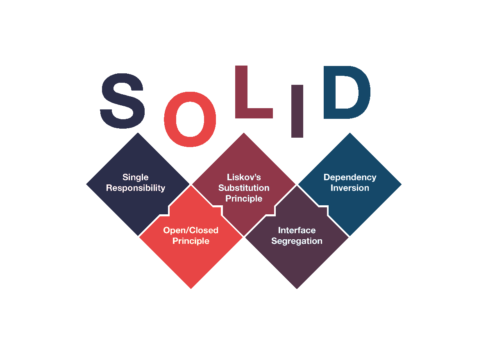

# [Uncle Bob's SOLID principles made easy](https://www.youtube.com/watch?v=pTB30aXS77U)

* **solid_1.py**: Problemas com **Single Responsibility**. A classe Order está cuidando tanto do "carrinho de compras" como do pagamento. Será preciso separar o pagamento como outra classe. Sempre lembre da frase: um módulo precisa ser responsável por um, e apenas um, stakeholder/ator (ter apenas uma razão para mudança). Se seu módulo atende diferentes atores, ele está infrigindo o princípio *S*.

* **solid_2.py**: Neste módulo, resolvemos o problema de Single Responsibility separando o processador de pagamento da classe order, mas na classe que processa o pagamento, violamos o princípio de **Open-Closed** que diz que uma classe precisa ser "fechada" para mudança mas "aberta" para ser estendida suas possibilidades. No caso da classe que processa pagamento, devemos antecipar que o stakeholder, dependente deste método, poderá desejar adicionar outros meios de pagamento, como PayPal, BitCoin, etc. Neste cenário, precisaríamos mudar a classe PaymentProcessor, o que viola o princípio *O*. 

* **solid_3.py**: aqui corrigimos a violação do princípio *O* atraves da abstração do método *pay* e deixamos isso aberto para futuros processadores de pagamento (que serão subclasses), protegendo (fechando) PaymentProcessor de mudanças. Mas desta vez estamos violando o princípio de **Liskov Substitution**, que diz que devemos ser capazes de substituir a superclasse por uma de suas subclasses sem prejudicar o correto funcionamento do programa. Note que a subclasse PayPalPaymentProcessor não usa *security_code* mas *e-mail*. Caso alguém no futuro, por algum motivo, estivesse usando *PaymentProcessor* em algum outro ponto do programa e precise colocar *PayPalPaymentProcessor* no lugar, então o programa não funcionará corretamente.

* **solid_4.py**: resolvemos o problema da violação do princípio *L* quando removemos o *security_code* como parâmetro da superclass *PaymentProcessor* e deixamos isso como inicializador de suas subclasses.

* **solid_5.py**: neste aquivo adicionamos o método *auth_sms* (autenticação de dois fatores) para exemplificar o quarto princípio, chamado de **Interface Segregation** que diz para evitarmos ter interfaces muito amplas e correr o risco de uma das interfaces não serem usadas por um dos atores, ou seja, este princípio incentiva ter várias interfaces com propósitos muito bem definidos e específicos do que uma de uso geral e muito genérica. Neste arquivo temos uma violação deste princípio dado que definimos a interface *auth_sms* na superclasse supondo que todas as suas subclasses usariam este método de autenticação, mas o método de pagamento com crédito não usa essa interface (isso também é uma violação do princípio *L* dado que não conseguimos substituir a superclasse por esta sua subclasse).

* **solid_6.py**: aqui resolvemos a infração do princípio *I* criando uma interface mais específica chamada *PaymentProcessor_SMS* que é herdada pelas classes de pagamento que precisam da autenticação de dois fatores, já a classe de pagamento a crédito continua herdando apenas a superclasse *PaymentProcessor* e não precisa mais se preocupar em implementar um método desnecessário para *auth_sms*.

* **solid_7.py**: podemos resolver a infração do princípio *I* de outra forma. Ao invés de usar herança de classe, como fizemos no *solid_6.py*, podemos usar composição. O método de autenticação de dois fatores enviada pelo SMS pode ser uma classe e esta mesma classe pode ser uma parte da classe de pagamento. Fizemos isso aqui criando a classe *SMSAuth*.

